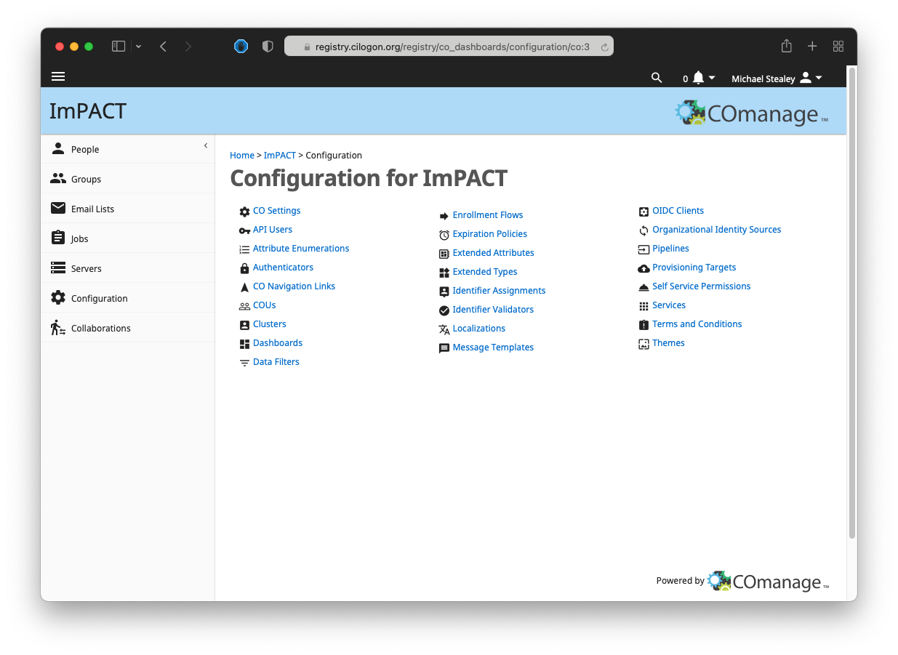
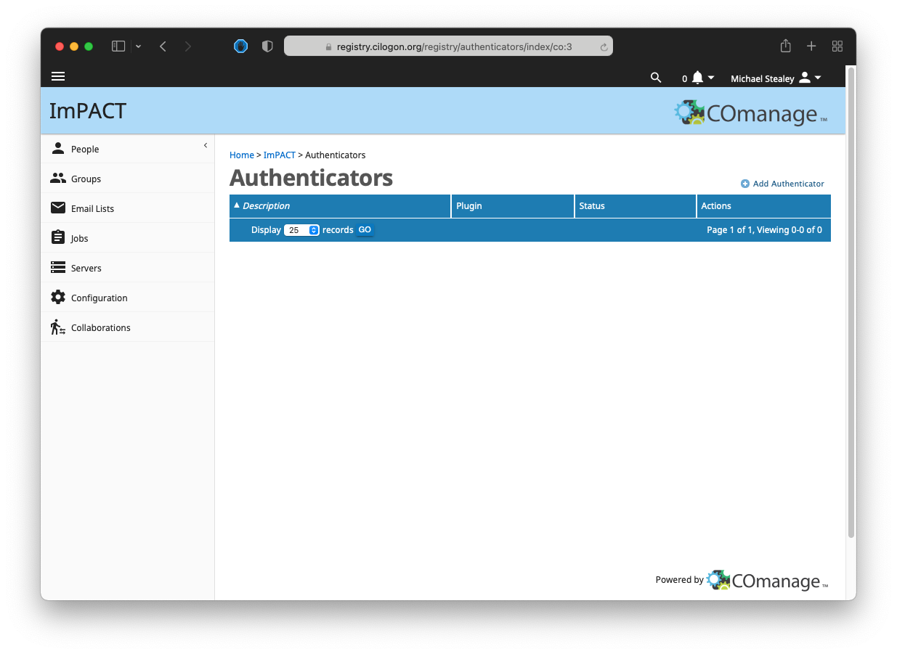
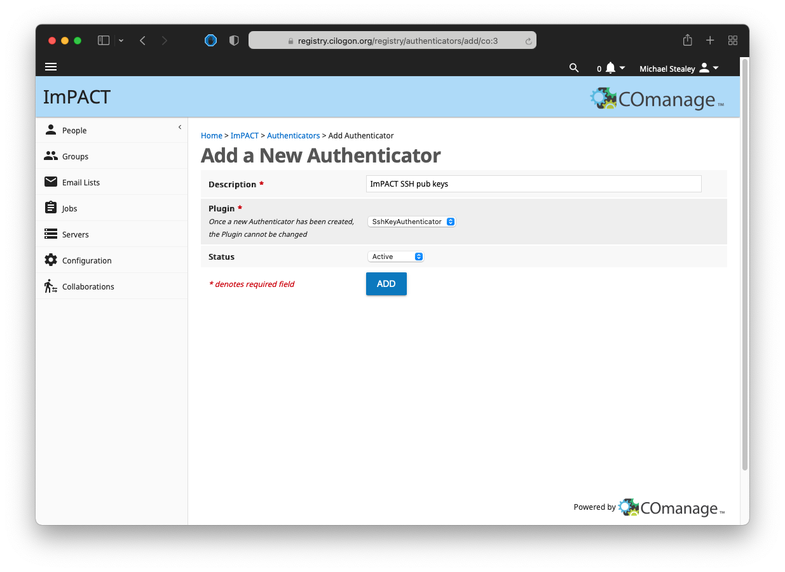
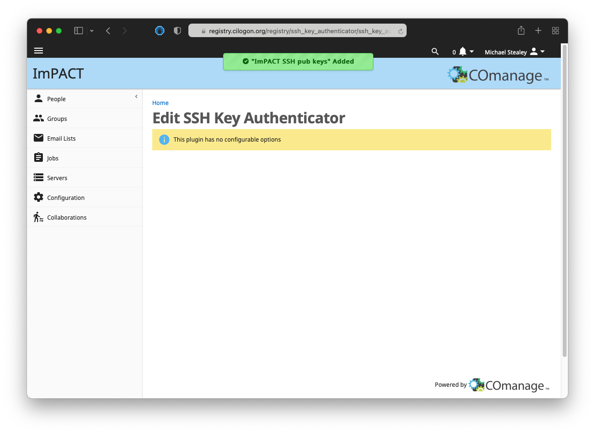
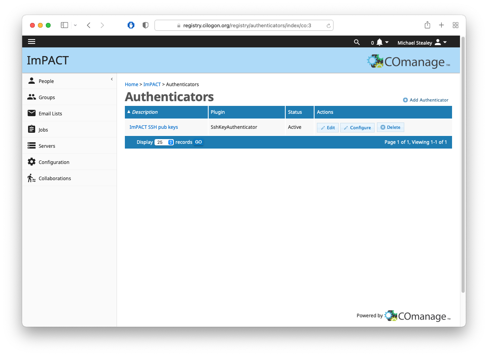
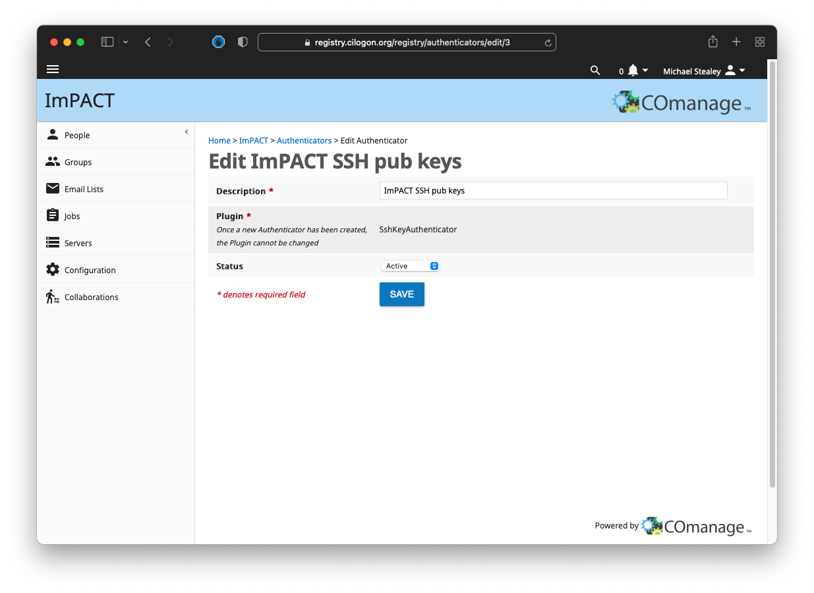

# python-comanage-api

Provide a limited Python 3 implementation of COmanage REST API v1: [https://spaces.at.internet2.edu/display/COmanage/REST+API+v1](https://spaces.at.internet2.edu/display/COmanage/REST+API+v1)

All responses are in [JSON (ECMA-404)](https://www.ecma-international.org/publications-and-standards/standards/ecma-404/) format

### API endpoints

- [COU API](https://spaces.at.internet2.edu/display/COmanage/COU+API)
    - add: `cous_add(name: str, description: str, parent_id=None) -> json`
    - delete: `cous_delete(cou_id: int) -> json`
    - edit: `cous_edit(cou_id: int, name: str, description: str, parent_id=None) -> json`
    - view all (per co): `cous_view_all() -> json`
    - view one: `cous_view_one(cou_id: int) -> json`

- [CoPerson API](https://spaces.at.internet2.edu/display/COmanage/CoPerson+API)
    - add (not implemented): `copeople_add() -> json`
    - delete (not implemented): `copeople_delete() -> json`
    - edit (not implemented): `copeople_edit() -> json`
    - find (not implemented): `copeople_find() -> json`
    - match: `copeople_match(given=None, family=None, mail=None, distinct_by_id=True) -> json`
    - view all (per co): `copeople_view_all() -> json`
    - view all (per identifier): `copeople_view_per_identifier(identifier: str, distinct_by_id=True) -> json`
    - view one: `copeople_view_one(coperson_id: int) -> json`

- [CoPersonRole API](https://spaces.at.internet2.edu/display/COmanage/CoPersonRole+API)
    - add: `copersonroles_add(coperson_id: int, cou_id: int, status=None, affiliation=None) -> json`
    - delete: `copersonroles_delete(copersonrole_id: int) -> json`
    - edit: `copersonroles_edit(copersonrole_id: int, coperson_id: int, cou_id: int, status=None, affiliation=None) -> json`
    - view all (not implemented): `copersonroles_view_all() -> json`
    - view all (per co_person): `copersonroles_view_per_coperson(coperson_id: int) -> json`
    - view all (per cou): `copersonroles_view_per_cou(cou_id: int) -> json`
    - view one: `copersonroles_view_one(copersonrole_id: int) -> json`
    
    **NOTE**: when provided, valid values for `status` and `affiliation` as follows:

    ```python
    STATUS_OPTIONS = ['Active', 'Approved', 'Confirmed', 'Declined', 'Deleted', 'Denied', 'Duplicate', 
    'Expired', 'GracePeriod', 'Invited', 'Pending', 'PendingApproval', 'PendingConfirmation', 'Suspended']
    AFFILIATION_OPTIONS = ['affiliate', 'alum', 'employee', 'faculty', 'member', 'staff', 'student']
    ```

- [Identifier API](https://spaces.at.internet2.edu/display/COmanage/Identifier+API)
    - add (not implemented): `identifiers_add() -> json`
    - assign (not implemented): `identifiers_assign() -> json`
    - delete (not implemented): `identifiers_delete() -> json`
    - edit (not implemented): `identifiers_edit() -> json`
    - view all: `identifiers_view_all() -> json`
    - view per entity: `identifiers_view_per_entity(entity_type: str, entity_id: int) -> json`
    - view one: `identifiers_view_one(identifier_id: int) -> json`

    **NOTE**: when provided, valid values for `entity_type` as follows:

    ```python
    ENTITY_OPTIONS = ['codeptid', 'cogroupid', 'copersonid', 'organizationid', 'orgidentityid']
    ```

- [Name API](https://spaces.at.internet2.edu/display/COmanage/Name+API)
    - add (not implemented): `names_add() -> json`
    - delete (not implemented): `names_delete() -> json`
    - edit (not implemented): `names_edit() -> json`
    - view all: `names_view_all() -> json`
    - view per person: `names_view_per_person(person_type: str, person_id: int) -> json`
    - view one: `names_view_one(name_id: int) -> json`

    **NOTE**: when provided, valid values for `person_type` as follows:

    ```python
    PERSON_OPTIONS = ['copersonid', 'orgidentityid']
    ```

- [SshKey API](https://spaces.at.internet2.edu/display/COmanage/SshKey+API) (**REQUIRES**: The [SSH Key Authenticator plugin](https://spaces.at.internet2.edu/display/COmanage/SSH+Key+Authenticator+Plugin) which manages SSH Public Keys for CO People.)
    - add (not working): `ssh_keys_add(coperson_id: int, ssh_key: str, key_type: str, comment: str, ssh_key_authenticator_id=None) -> json`
    - delete: `ssh_keys_delete(ssh_key_id: int) -> json`
    - edit (401 Unauthorized): `ssh_keys_edit(ssh_key_id: int, coperson_id: int, ssh_key=None, key_type=None, comment=None, ssh_key_authenticator_id=None) -> json`
    - view all (401 Unauthorized): `ssh_keys_view_all() -> json`
    - view all (per co_person): `ssh_keys_view_per_coperson(coperson_id: int) -> json`
    - view one: `ssh_keys_view_one(ssh_key_id: int) -> json`

    **NOTE**: when provided, valid values for `ssh_key_type` as follows:

    ```python
    SSH_KEY_OPTIONS = ['ssh-dss', 'ecdsa-sha2-nistp256', 'ecdsa-sha2-nistp384', 
    'ecdsa-sha2-nistp521', 'ssh-ed25519', 'ssh-rsa', 'ssh-rsa1']
    ```

    
**DISCLAIMER: The code herein may not be up to date nor compliant with the most recent package and/or security notices. The frequency at which this code is reviewed and updated is based solely on the lifecycle of the project for which it was written to support, and is not actively maintained outside of that scope. Use at your own risk.**


## Usage

### From PyPi

TODO

See code in [examples](examples/) directory for usage

### From Source

Install supporting packages

```
virtualenv -p /usr/local/bin/python3 venv
source venv/bin/activate
pip install -r comanage_api/requirements.txt
```

Create a `.env` file from the included template

```console
cp template.env .env
```

Configure `.env` based on your COmanage Registry settings

```env
# COmanage API user and pass
COMANAGE_API_USER=co_123.api-user-name
COMANAGE_API_PASS=xxxx-xxxx-xxxx-xxxx
# COmanage CO Information
COMANAGE_CO_NAME=RegistryName
COMANAGE_CO_ID=123
# COmanage registry URL
COMANAGE_URL=https://FQDN_OF_REGISTRY
# COmanage SshKeyAuthenticator
COMANAGE_SSH_KEY_AUTHENTICATOR_ID=123
```

See code in [examples](examples/) directory for usage

## SSH Key Authenticator Plugin


The [SSH Key Authenticator plugin](https://spaces.at.internet2.edu/display/COmanage/SSH+Key+Authenticator+Plugin) manages SSH Public Keys for CO People.

- The SSH Key Authenticator plugin is available as of Registry v3.3.0. Prior to this version, SSH Key management is available via the CO Person canvas.

After registration you can find the value for `COMANAGE_SSH_KEY_AUTHENTICATOR_ID` in the URL for editing the Authenticator:

- It would be **3** in this example URL: [https://registry.cilogon.org/registry/authenticators/edit/3]()

### Adding a new SSH Key Authenticator in COmanage

To create a new SSH Key Authenticator first select the "Authenticators" option from the COmanage configuraiton page



Next select the "Add Authenticator" option



Populate the required fields and set Status to "Active" and "Add" the Authenticator



Upon success a green box will denote the new Authenticator has been added



Now when choosing the "Authenicators" option from the COmanage configuration page you should see your newly created Authenticator



Pressing the "Edit" option will display the fields for the Authenticator along with its `SshKeyAuthenticatorId` value in the URL (**3** in this example)



## References

- COmanage REST API v1: [https://spaces.at.internet2.edu/display/COmanage/REST+API+v1](https://spaces.at.internet2.edu/display/COmanage/REST+API+v1)
- COU API: [https://spaces.at.internet2.edu/display/COmanage/COU+API](https://spaces.at.internet2.edu/display/COmanage/COU+API)
- CoPerson API: [https://spaces.at.internet2.edu/display/COmanage/CoPerson+API](https://spaces.at.internet2.edu/display/COmanage/CoPerson+API)
- CoPersonRole API: [https://spaces.at.internet2.edu/display/COmanage/CoPersonRole+API](https://spaces.at.internet2.edu/display/COmanage/CoPersonRole+API)
- Identifier API: [https://spaces.at.internet2.edu/display/COmanage/Identifier+API](https://spaces.at.internet2.edu/display/COmanage/Identifier+API)
- Name API: [https://spaces.at.internet2.edu/display/COmanage/Name+API](https://spaces.at.internet2.edu/display/COmanage/Name+API)
- SsHKey API: [https://spaces.at.internet2.edu/display/COmanage/SshKey+API](https://spaces.at.internet2.edu/display/COmanage/SshKey+API)
- SSH Key Authenticator Plugin: [https://spaces.at.internet2.edu/display/COmanage/SSH+Key+Authenticator+Plugin](https://spaces.at.internet2.edu/display/COmanage/SSH+Key+Authenticator+Plugin)
- PyPi: [https://pypi.org](https://pypi.org)
